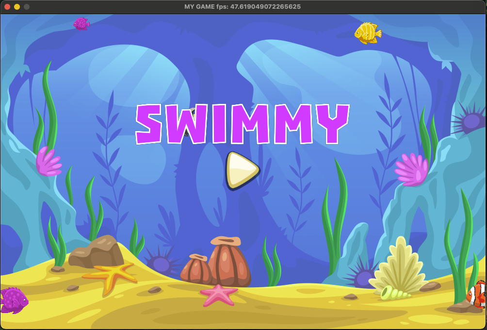
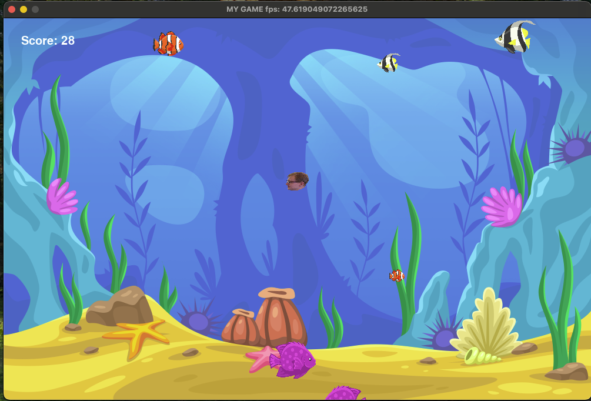

# HungryFishGame
A remake of a childhood game I used to play
Uses pygame Library

Arrow keys to move.

Objective of the game is to eat similar or smaller sized fishes to grow bigger!



 |

### Python Virtual Environment Setup

Follow these steps to set up your environment and install dependencies.

### Prerequisites

- Python 3.x must be installed  
  Check your version:
  ```sh
  python --version
  # or
  python3 --version
  ```

### Create a Virtual Environment

```sh
python -m venv venv
# or
python3 -m venv venv
```

### Activate the Virtual Environment

#### Windows
```sh
venv\Scripts\activate
```

#### macOS/Linux
```sh
source venv/bin/activate
```

### Install Dependencies

```sh
pip install -r requirements.txt
```

### Deactivate the Environment

```sh
deactivate
```